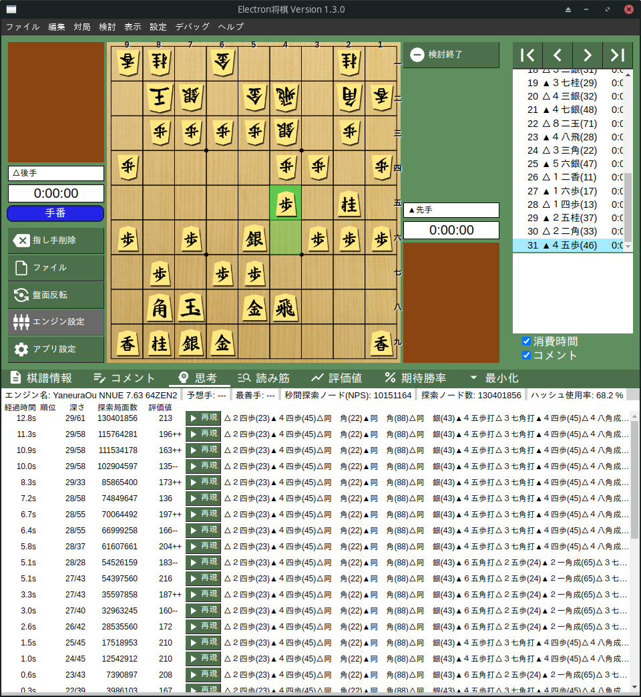

## はじめに

うちには強いマシンが Manjaro サーバしかないので，将棋の解析をこのサーバでやりたい．
ただし，いわゆる将棋ソフトは Windows で使うことを前提としているので，Manjaro なんていう変な環境でトライした人はいなさそうだ．
突貫工事ではあるが，Manjaro のデスクトップ環境で将棋の解析ができる環境を作ったので，その手順を記録しておく．

年の瀬になにやってんだ．



## 1. UI（Electron 将棋）をインストール

まず Electron 将棋 の公式リポジトリからプロジェクト一式をダウンロードする．npm でビルドし，生成された実行バイナリを `~/.local/bin/` に配置する．npm 系のコマンドは既にインストールしていたので，環境によっては準備が必要かもしれない．

```
$ gh repo clone https://github.com/sunfish-shogi/electron-shogi
$ cd electron-shogi
$ git checkout v1.3.0 # 安定版が v1.3.0 らしい
$ npm install @vue/cli @vue/cli-service-global
$ npm run electron:build
$ find . -name 'ElectronShogi*'
./dist_electron/ElectronShogi-1.3.0.AppImage
$ cp $(find . -name 'ElectronShogi*') ~/.local/bin/
```

## 2. エンジン（YaneuraOu）をインストール

こちらもまずは YaneuraOu の公式リポジトリからプロジェクト一式をダウンロードする．Makefile の設定を環境に合わせて編集し，コンパイルを実施する．
Manjaro サーバの CPU は Ryzen 7 3700X なので，TARGET\_CPU は ZEN2 とした．

```
$ gh repo clone https://github.com/Kenta11/YaneuraOu
$ cd YaneuraOu/source
$ vim Makefile # 今回は TARGET_CPU を AVX2 から ZEN2 に変更
$ make # 並列オプション -j を使うとコケたぞ
$ find . -name YaneuraOu-by-gcc
./YaneuraOu-by-gcc
```

## 3. 評価関数（水匠5）をインストール

水匠5 の評価関数をダウンロードする．YaneuraOu の実行バイナリがあるディレクトリ下の `eval` ディレクトリに `nn.bin` を配置する．

```
$ gh repo clone https://github.com/HiraokaTakuya/get_suisho5_nn
$ cp get_suisho5_nn/nn.bin /path/to/YaneuraOu/source/eval/
```

## 4. UI からエンジンを選択

- `electron-shogi` を実行
- "設定">"エンジン設定" を選択し，エンジン（YaneuraOu）を選択
- "検討">"検討開始" で局面を解析できる

## おわりに

将棋の局面の解析が自宅マシンでできるようになった．
以上の方法で構築した環境がベストなのかは分からないが，少なくともプロ棋士が使うような解析環境は必要ないので，これで満足だ．

